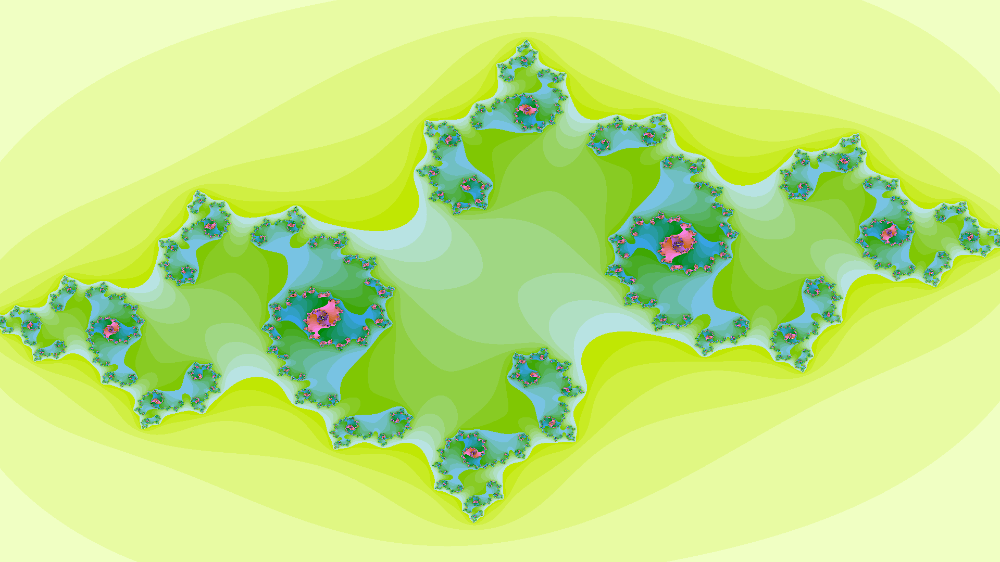
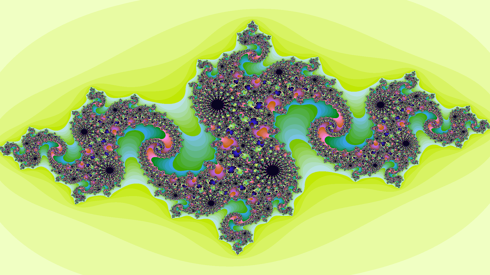
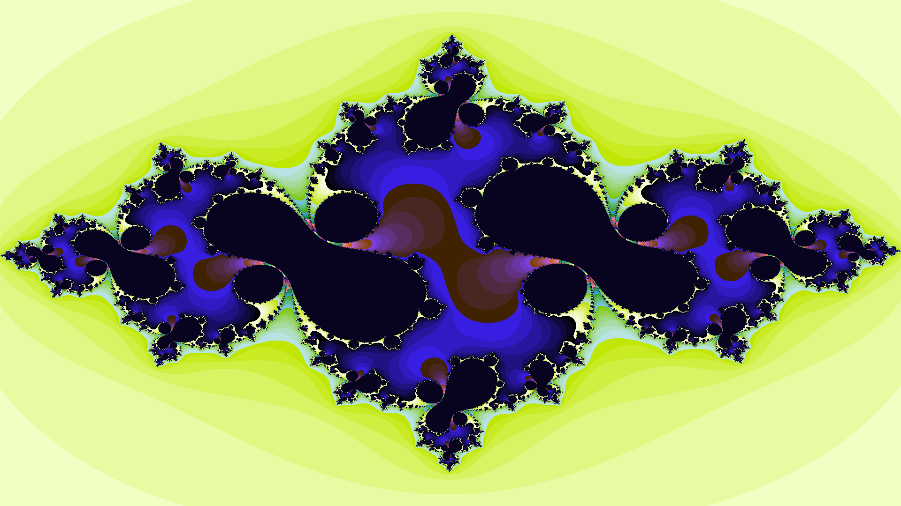

# Julia-Fractal-Set
## Exploring fractals in the Julia set

> The infinite! No other question has ever moved so profoundly the spirit of man.

David Hilbert

> ...the infinite sea of complexity includes two islands: one of Euclidean simplicity, and also a second of relative simplicity in which roughness is present, but is the same at all scales.

Benoît Mandelbrot, [2004](https://www.edge.org/conversation/benoit_mandelbrot-a-theory-of-roughness)


## Context
Various great sources exist that present the reader with an overview of the [Julia set](https://www.google.com/url?sa=t&rct=j&q=&esrc=s&source=web&cd=3&ved=2ahUKEwjtvNCWqpblAhXMITQIHUhtBKkQFjACegQICxAG&url=https%3A%2F%2Fen.wikipedia.org%2Fwiki%2FJulia_set&usg=AOvVaw1TkOuJzmcaF8RU5kldqgG_) and, more broadly, [fractals](https://en.wikipedia.org/wiki/Fractal). (I highly suggest reading [Julia Set Fractal (2D)](http://paulbourke.net/fractals/juliaset/) by Paul Bourke and [
Understanding Julia and Mandelbrot Sets](https://www.karlsims.com/julia.html) by Karl Sims.)

As such, only details regarding the code itself will be entertained in this document.

For each pixel of the image, the code performs a calculation and the pixels' color is a function of that calculation. That function is  which is performed recursively. Since both z and c are complex, we treat them as being composed of a real and imaginary component. The real component will be referred to with x and the imaginary component with y.


## Usage

**Gifs and images such as those displayed above can be rendered using the code.** Note: the code is used to render the images; other software must be used to make gifs, e.g. Adobe Photoshop.

The code is based on the following parameters:
- w: image width
- h: image height
- zoom: zoom level
- R: escape radius
- cX: constant along the x axis
- cY: constant along the y axis
- moveX: shift the image along the x axis
- moveY: shift the image along the y axis
- maxIter: maximum number of iterations
- filename: default filename is a description of the settings
- disp: display the fractal; default is False

All of these parameters have default values.

**The code can be run through *command line arguments* or by *custom function calls***.

### Command Line Arguments

For a quick demo, enter the following into the command line:
``` bash
$ python julia.py sample
```

Generally, a command line call should follow the following format:

``` bash
$ python julia.py cX cY filename
```

Here, cX and cY should be floats; filename will be typecast as a string and indicated what filename should be used to save the rendered image(s). While laconic and lacking in parameters, adequate tuning of these two parameters will suffice to produce interesting results.

### Custom Function Calls

To render a series of images, a for-loop will be useful. To implement a custom loop, modifications can be made to the *runtype* function.

``` python
def runtype(args, ):
    ...
    # Custom function calls
    for i in range(20):
        julia(cX=-0.8702+i/1000, filename=i, disp=False)
```

To run those custom function calls, simply execute the file without passing in any parameters:

``` bash
$ python julia.py
```

## Gallery / Examples

Some interesting ideas would be to vary the cX, cY, and/or zoom parameters to produce the effect of motion. Experiment with different values for each parameter to get a feel for what fractals can be rendered.

Below is a gallery of fractals produced with this code.

### Gifs


### Images






